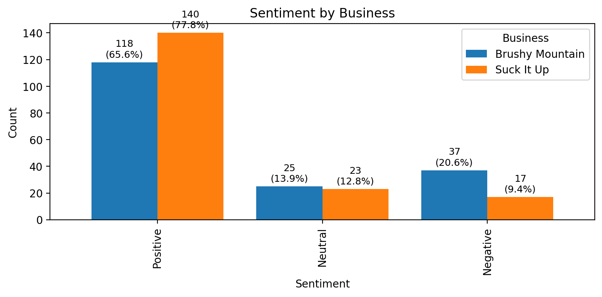
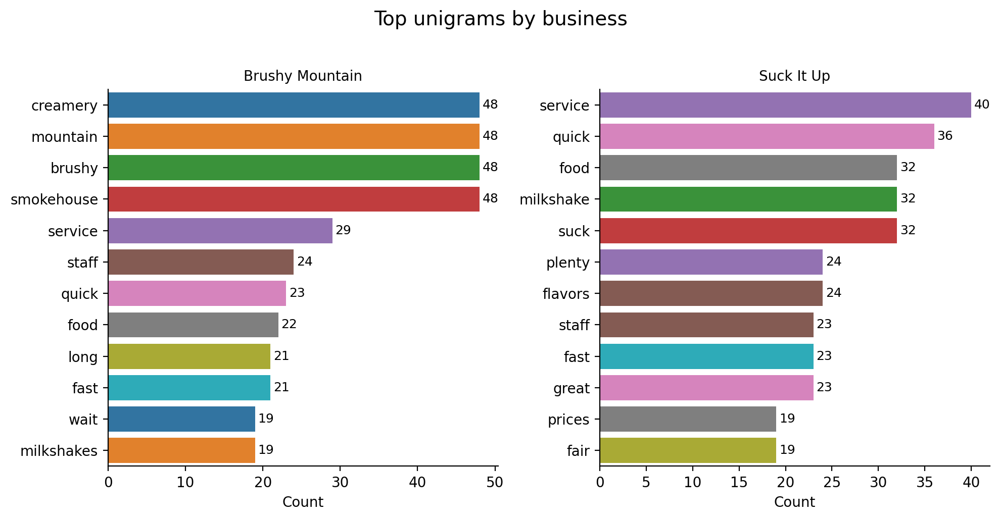
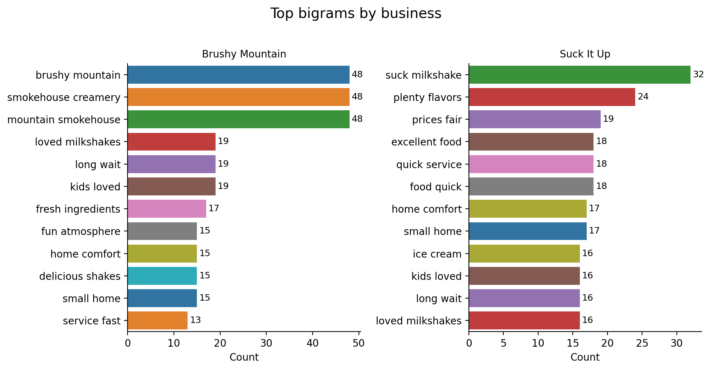

# Competitive Analysis — Text Analytics
[Overview](#overview) • [Methods](#methods) • [Data](#data-synthetic) • [How to run](#how-to-run) • [Results](#results-quick-look) • [Files](#files) • [Requirements](#requirements) • [Notes](#notes)

[← Back to portfolio root](../README.md)

Daily customer-review text analysis comparing two brands:

- **Suck It Up Milkshake Co.**
- **Brushy Mountain Smokehouse and Creamery**

All data in this repo is **synthetic** and safe to publish. It mirrors the schema of the original private project.

---

## Overview

- Goal: surface **sentiment**, **themes**, and **differences** in how customers talk about each business so decisions on service, staffing, and product can be data-informed.  
- Deliverables: clean notebook, reproducible synthetic data, and ready-to-share visuals.

---

## Methods

- **Sentiment**: rule/lexicon approach → Positive / Neutral / Negative  
- **N-grams**: **unigrams** and **bigrams** built from cleaned review text  
- **Topic cues**: light LDA / frequent-term exploration for recurring themes  
- **Visualization**: bar charts, distribution summaries  
- **Pre-processing**: lowercasing, punctuation/number removal, stop-word removal, optional lemmatization

---

## Data (synthetic)

- `suck_it_up_reviews.csv` — synthetic reviews for Suck It Up  
- `brushy_mountain_reviews.csv` — synthetic reviews for Brushy Mountain  

Columns: typical review fields such as `review_id`, `date`, `rating`, `text`, plus derived fields like `Sentiment Label`.

---

## How to run

1. Put both CSVs in this same folder (`competitive-analysis/`).  
2. Open **`Competitive Analysis.ipynb`** and run top → bottom.  
3. The notebook writes/uses the three figures embedded below.

---

## Results (quick look)

### Sentiment comparison
<!-- Sentiment comparison -->
<a href="sentiment_compare.png">
  
</a>

**Takeaways:**
- Both brands are strongly positive, but **Suck It Up** shows a higher positive share and lower negatives.  
- **Brushy Mountain** has relatively more negative comments (service/time-to-serve signals).

### Frequent terms (themes)
<!-- Unigrams -->
<a href="top_unigrams_by_business.png">
  
</a>

<!-- Bigrams -->
<a href="top_bigrams_by_business.png">
  
</a>

**Takeaways:**
- **Suck It Up** themes: *quick service*, *plenty flavors*, *milkshake*, *prices fair*.  
- **Brushy Mountain** themes: *creamery*, *smokehouse*, *mountain*; bigrams highlight *“loved milkshakes”*, but also **“long wait”** and **“kids loved”** (family traffic).  
- Combined with sentiment, this suggests **Suck It Up** wins on speed/experience; **Brushy Mountain** leans toward sit-down / family occasion.

> Replace bullets with observations from your run if they differ.

---

## Files

- **Notebook**: [`Competitive Analysis.ipynb`](Competitive%20Analysis.ipynb)  
- **Data**: [`suck_it_up_reviews.csv`](suck_it_up_reviews.csv), [`brushy_mountain_reviews.csv`](brushy_mountain_reviews.csv)  
- **Figures**:  
  - `sentiment_compare.png`  
  - `top_unigrams_by_business.png`  
  - `top_bigrams_by_business.png`

---

## Requirements

Minimal stack used in the notebook:

pandas, numpy, scikit-learn, matplotlib, seaborn, nltk


If using NLTK stop-words for text cleaning, run once in a Python cell:

```python
import nltk
nltk.download('stopwords')
```

## Notes

The analysis here is fully reproducible with the synthetic data.

The private/original project used the same pipeline and produced similar patterns.

> See the [Provenance & acknowledgements](../README.md#provenance--acknowledgements) note in the repo root.

