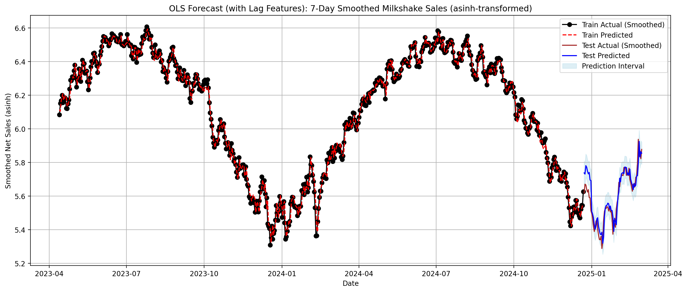
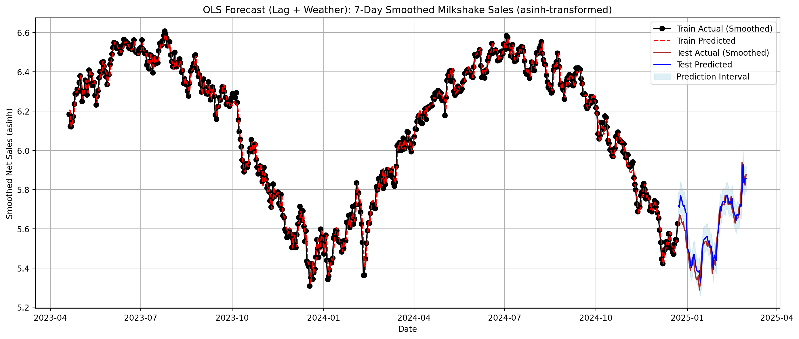

# Milkshake Sales Forecasting — OLS (Lags & Weather) vs. ARIMA/ARIMAX

> Daily demand forecasting on a **synthetic** retail dataset. Compares **OLS with lag features** (and **weather** exogenous variables) versus **ARIMA/SARIMAX**.  
> **Best model in this repo:** *OLS (lags + weather)* — strongest point accuracy and interval calibration.

<!-- Badges (optional). Remove any you don't want. -->


<p align="center">
  <a href="MilkshakeModeling.ipynb"><b>Open the notebook</b></a> •
  <a href="ItemSales_2023_2025.csv">ItemSales_2023_2025.csv</a> •
  <a href="Weather Data.csv">Weather Data.csv</a> •
  <a href="#-results-synthetic-data--dollars">Skip to results</a>
</p>

<p align="center">
  <a href="MilkshakeModeling.ipynb">
    
  </a>
  &nbsp;&nbsp;
  <a href="MilkshakeModeling.ipynb">
    
  </a>
</p>


➡️ Notebook: [`MilkshakeModeling.ipynb`](./MilkshakeModeling.ipynb)  
➡️ Data: [`ItemSales_2023_2025.csv`](./ItemSales_2023_2025.csv), [`Weather Data.csv`](./Weather%20Data.csv)

---

## 🧭 Overview
Daily forecasting for **milkshake net sales** using a progression of models:

1. **OLS with lagged features** (autoregressive terms such as *y[t-1], y[t-7], y[t-14]*)
2. **OLS with lagged features + weather** (exogenous: `MinTemp`, `Precip`)
3. **ARIMA** baseline
4. **ARIMAX/SARIMAX** with weather as exogenous covariates

**Headline (synthetic data in this repo):**  
- **Overall winner:** **`OLS (lags + weather)`** — best **point accuracy** (RMSE/MAE) **and** best **interval calibration** (PI coverage, % within \$ thresholds).  
- **Reliable fallback:** **`OLS (lags)`** — very strong accuracy **without** external dependencies; use when weather forecasts are unavailable/low-quality.

> All data here is **synthetic** and safe to publish. It mirrors the original project’s schema so the analysis is fully reproducible.  
> On the original (non-public) dataset, `OLS (lags)` slightly edged out on point metrics while `OLS (lags + weather)` had the best interval coverage—the choice can be objective-driven.

---

## 🧰 Methods
- **Feature engineering:** calendar fields; lagged sales (1, 7, 14…); optional smoothing/rolling means; weather merged by date.
- **Models:** OLS (lags), OLS (lags+weather), ARIMA(p,d,q), ARIMAX/SARIMAX with exogenous weather.
- **Evaluation:** MAE, RMSE, **% within \$20**, **% within \$9**, **prediction-interval (PI) coverage**; fixed/rolling origin split.
- **Diagnostics:** residual plots, ACF/PACF, parameter summaries; leakage checks (lags built from **past only**).

---

## 🗃️ Data (synthetic)
- **`ItemSales_2023_2025.csv`** — transaction-level export (e.g., `Date`, `Item`, `Qty`, `Net Sales`, …).  
- **`Weather Data.csv`** — NOAA-style file with `DATE`, `TMIN`, `TMAX`, `PRCP` (others left blank/NaN to mirror source).

Date window: **2023-01-01 → 2025-06-30**

---

## ▶️ How to run
1. Put both CSVs in the **same folder** as the notebook.  
2. Open **`MilkshakeModeling.ipynb`** and run top→bottom.

**Load & merge snippet**
```python
import pandas as pd

items   = pd.read_csv("ItemSales_2023_2025.csv", parse_dates=["Date"])
weather = pd.read_csv("Weather Data.csv")  # parse DATE as needed
weather["DATE"] = pd.to_datetime(weather["DATE"], errors="coerce")

df = (items.assign(Date=pd.to_datetime(items["Date"]))
           .merge(weather[["DATE","TMIN","TMAX","PRCP"]],
                  left_on="Date", right_on="DATE", how="left")
           .sort_values("Date"))
```


## ✅ Results (synthetic data • dollars)

> Dollar metrics are on the original scale.  
> For reference, on the asinh scale the **OLS (lags)** out-of-sample error was **RMSE ≈ 0.062, MAE ≈ 0.047**.

| Model                     |   ME |   RMSE |   MAE | % within $20 | % within $9 | PI coverage | Notes |
|---------------------------|-----:|-------:|------:|-------------:|------------:|------------:|------|
| **OLS (lags + weather)**  | 2.67 | **8.21** | **6.16** | **97.10%** | **78.26%** | **81.16%** | **Overall winner**; best accuracy **and** intervals |
| **OLS (lags)**            | 2.84 | 8.88 | 6.54 | 95.65% | 75.36% | 76.81% | Strong fallback without exogenous inputs |
| ARIMA (7,1,0)             |  —   | 39.36 | 34.61 | 0.00% | — | — | Baseline TS, far worse on this data |
| SARIMAX (with weather)    |  —   | — | — | 0.00% | — | — | **Unstable** on this synthetic set; see note below |


### Interpretation
- Demand shows **strong weekly seasonality**; lag terms model this directly—hence both OLS variants perform best.  
- **Temperature** tends to lift demand; **precipitation** dampens it slightly. Adding weather improves **interval calibration** (higher PI coverage) while also nudging error down.
- With a largely linear + exogenous signal, **OLS with lags (and weather)** is most actionable for staffing/inventory planning.

> **Note on SARIMAX instability:** one run produced blow-up errors and 0% within \$20. This typically indicates a transform/back-transform or index alignment mismatch. Quick checks:
> - Ensure the **back-transform** matches the transform (e.g., `asinh` ⇄ `sinh`) and is applied exactly once.  
> - Verify **index alignment** of `endog` and `exog` after differencing (same dates, no NaNs).  
> - Keep exogenous variables on the training scale and avoid future leakage.  
> - If experimenting, try `enforce_stationarity=False, enforce_invertibility=False` and confirm residual diagnostics.


## 📁 Files
- `MilkshakeModeling.ipynb` — EDA → features → models → evaluation  
- `ItemSales_2023_2025.csv` — synthetic sales  
- `Weather Data.csv` — synthetic weather  
- `ols_lags_forecast.png` — example forecast figure  
- `README.md` — this file

## 🔧 Requirements
`pandas`, `numpy`, `statsmodels`, `scikit-learn`, `matplotlib`, `seaborn`

Optional: add a `requirements.txt` and install with:
```bash
pip install -r requirements.txt
