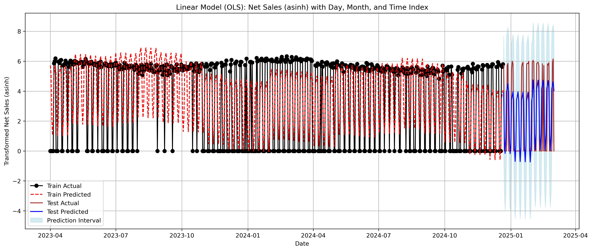
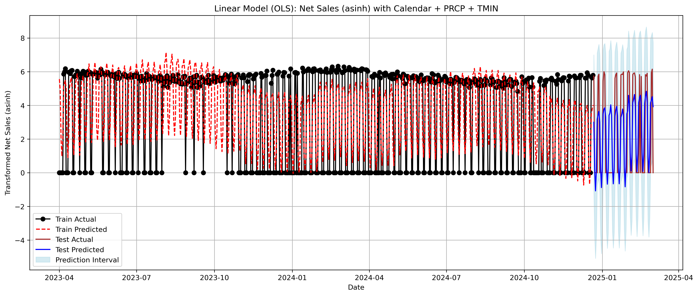

# Storewide Sales Forecasting — Linear Models (Calendar vs Calendar+Weather)
[← Back to portfolio root](../README.md)

Daily **store-level net sales** forecasting using lightweight, interpretable linear models:

**Notebook:** [StoreSalesForecasting.ipynb](StoreSalesForecasting.ipynb)

- **Calendar-only** OLS with lagged sales (y[t-1], y[t-7], y[t-14]) + calendar features (DOW, holiday/weekend, month, etc.)
- **Calendar + Weather** OLS with the same lags/features **plus** exogenous weather (e.g., `TMIN`, `TMAX`, `PRCP`)
- Evaluation on a fixed **train ⇒ test** split with prediction intervals on the **dollar scale** (back-transformed)

> All data here is **synthetic** and safe to publish; it mirrors the schema and scale of the original private files so the analysis is reproducible.

---

### Data (synthetic)

- [StoreSales_Summary_23-24_synthetic.csv](StoreSales_Summary_23-24_synthetic.csv) — daily store summary, prior year  
- [StoreSales_Summary_24-25_synthetic.csv](StoreSales_Summary_24-25_synthetic.csv) — daily store summary, current year  
- [Weather_Data_SYNTH.csv](Weather_Data_SYNTH.csv) — weather data (DATE, TMIN, TMAX, PRCP)

Typical columns (representative):
- `Date` (daily), `Net Sales`, optional derived calendar fields (DOW, month, holiday flags…)
- Weather: `DATE`, `TMIN`, `TMAX`, `PRCP` (merged to sales by date)

---

## ▶️ How to run

1. Put both CSVs in this **same folder** as the notebook.
2. Open the notebook (`StoreSalesForecasting.ipynb`) and run **top → bottom**.
3. The notebook will:
   - build features (calendar + lags; optional weather merge),
   - fit **calendar-only** and **calendar+weather** OLS models,
   - generate prediction intervals on the **dollar** scale,
   - print accuracy summaries and save plots/figures.

---

## ✅ Results (synthetic data • dollars)

  
  &nbsp;&nbsp;
  

[OLS Calendar-only Forecast](./ols_calendar_forecast.png) ·
[OLS Calendar + Weather Forecast](./ols_calendar_weather_forecast.png)

Zoomable versions: [calendar-only (SVG)](./ols_calendar_forecast.svg) ·
[calendar + weather (SVG)](./ols_calendar_weather_forecast.svg)

> Metrics reported on the **test** period; PIs are computed and summarized on the **dollar** scale.

| Model                | ME   | RMSE  | MAE  | % within \$20 | PI coverage | Avg PI range |
|---------------------|:----:|:-----:|:----:|:--------------:|:-----------:|:------------:|
| **Calendar only**   | -69.54 | 89.98 | 59.49 | 50.70% | 88.73% | \$790.84 |
| **Calendar + weather** | -50.80 | 91.46 | 59.96 | 53.52% | 91.55% | \$734.92 |

### Interpretation
- **Point accuracy** (RMSE/MAE) is **very similar** across the two approaches; calendar-only is slightly lower RMSE in this run.
- **Weather** improves **PI calibration** (higher coverage) but achieves that with **wider intervals** (larger average PI range).
- For **operational** decisions where calibrated uncertainty matters (ordering, staffing), weather-augmented PIs are attractive.  
  When simplicity and narrower intervals are preferred, the calendar-only model is a strong baseline.

## 🧠 Methods (at a glance)

- **Features:** DOW, week/month/holiday flags, rolling/smoothing (optional), **lags** y[t-1], y[t-7], y[t-14]
- **Models:** OLS (calendar), OLS (calendar + weather)
- **Evaluation:** ME, RMSE, MAE; **% within \$20**; **PI coverage**; **avg PI width** (dollar scale)
- **Diagnostics:** leakage checks, residual/ACF sanity checks, alignment of `endog`/`exog` before differencing or transforms

---

## 📁 Files
- Notebook: [StoreSalesForecasting.ipynb](StoreSalesForecasting.ipynb)
- Data: `StoreSales_Summary_23-24_synthetic.csv`, `StoreSales_Summary_24-25_synthetic.csv, Weather Data_SYNTH.csv`
- Figures:
  - `ols_calendar_forecast.png` (and `ols_calendar_forecast.svg`)
  - `ols_calendar_weather_forecast.png` (and `ols_calendar_weather_forecast.svg`)

---

## 🧰 Requirements

`pandas`, `numpy`, `statsmodels`, `scikit-learn`, `matplotlib`, `seaborn`

(Optionally add a `requirements.txt` and install with `pip install -r requirements.txt`.)

---

## Notes

- Synthetic datasets keep the **shape and seasonality** of the original but contain **no private values**.
- Results above are from the current synthetic run; they will **reproduce** if you run the notebook as provided.

> See the [Provenance & acknowledgements](../README.md#provenance--acknowledgements) note in the repo root.
